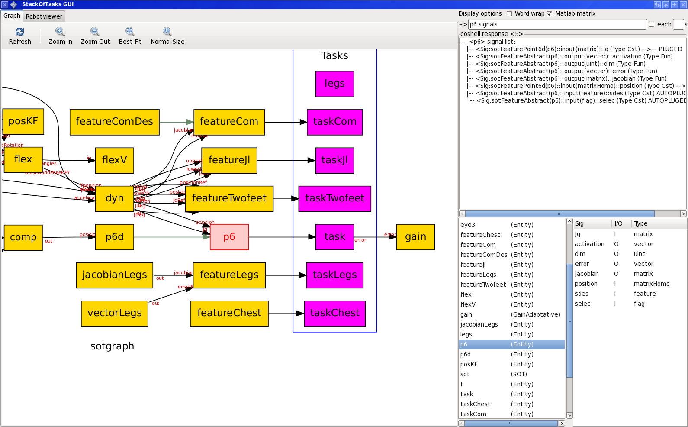
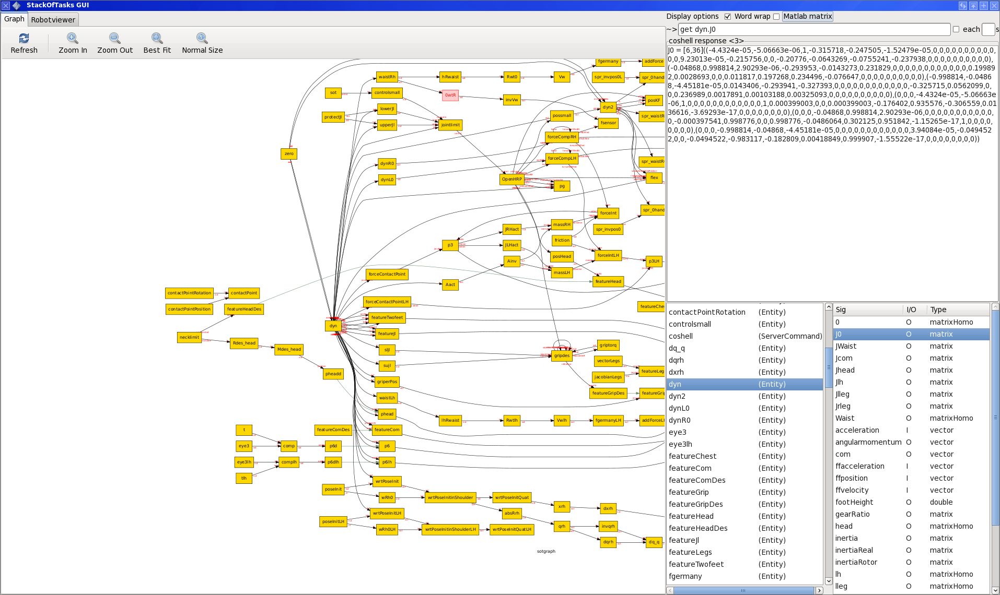

Screenshots
***********
Once installed, fire up ``sot_gui`` from a terminal. If sot is set up correctly
and running, you should be able to interact with it.

Hopefully, sot-gui interface is obvious and easy to use. Here are some
screenshots

